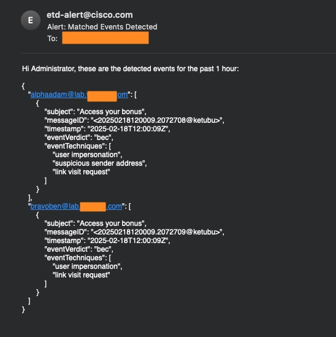

# ETD Event Monitoring Script

Cisco Email Threat Defense (ETD) remediates security violation and BEC email automatically. There is no current notification mechanisme available. In a nutshell, neither user nor admininstrator kept informed on what had been convicted and remediated. This script is trying to close this gap by adding on manual notification layer by monitoring mailboxes and send notification. Not monitoring all mailboxes, but the selected few, e.g. for VIP users, or important accounts.  

This repository contains a Python script to monitor email conviction events using Cisco's ETD API and notify an administrator of detected events via email.

## Features

- Queries Cisco ETD API for email conviction events.
- Filters events based on specified verdicts and techniques. E.g. only monitor BEC conviction. 
- Sends email notifications to an administrator if matching events are detected.
- Configurable to allow custom verdicts, techniques, monitor mailbox list, and email administrator settings.


Release update
- 18th Feb 2025 - First release 

## Prerequisites

- Python 3.x
- Access to Cisco ETD API with valid credentials.
- SMTP server details for sending emails.
- ETD API client credential and API Key - (From ETD -> Administration -> API Clients)
- Knowing your ETD instance location (check from the ETD URL)

## Installation

1. **Clone the repository:**

   ```bash
   git clone https://github.com/ciscoketcheon/ETD-Verdict-Watch.git
   cd ETD-Verdict-Watch
   ```

2. **Install required packages:**

   Ensure you have requests and smtplib installed. You can install requests using pip:
   ```bash
   pip install requests
   ```

## Configuration

Edit the script to configure the following variables:

   **API and Email Settings:**
        TOKEN_URL, SEARCH_URL, API_KEY, CLIENT_ID, CLIENT_SECRET
        SMTP_SERVER, SMTP_PORT, SMTP_USER, SMTP_PASSWORD, ADMIN_EMAIL

   **Monitored Mailboxes:**
        MONITORED_MAILBOXES: List of mailboxes to monitor.

   **Filtering Criteria:**
        VERDICT_VARIABLE: Verdict to match, leave empty to match all.
        TECHNIQUE_VARIABLE: Technique to match, leave empty to match all.

## Usage

   **Run the Script:**
   Execute the script to start monitoring:
   ```bash
   python etd-verdict-watch.py
   ```

**Schedule with Crontab (Optional):**
   You can schedule the script to run periodically using crontab. For example, to run every hour, add the following line to your crontab:
   ```bash
   0 * * * * /usr/bin/python3 /path/to/etd-verdict-watch.py
   ```

## How It Works

- API Query: The script queries the Cisco ETD API for email events within the last hour.

- Event Filtering: Events are filtered based on user-defined verdicts and techniques.

- Email Notification: If matching events are found, an email is sent to the administrator with details of the events.

- Customization: The script's behavior can be customized by adjusting the user-configurable variables at the top of the script.


## How do I know it works?

Sample notification email received:-



## References and userful links

ETD Guide -> https://www.cisco.com/c/en/us/td/docs/security/email-threat-defense/user-guide/secure-email-threat-defense-user-guide/intro.html
ETD API Guide -> https://developer.cisco.com/docs/message-search-api/
